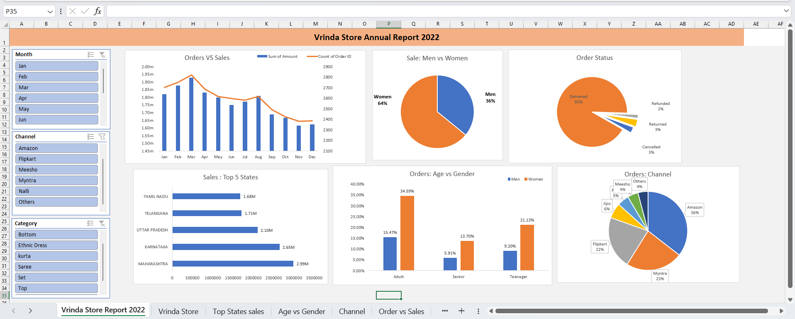
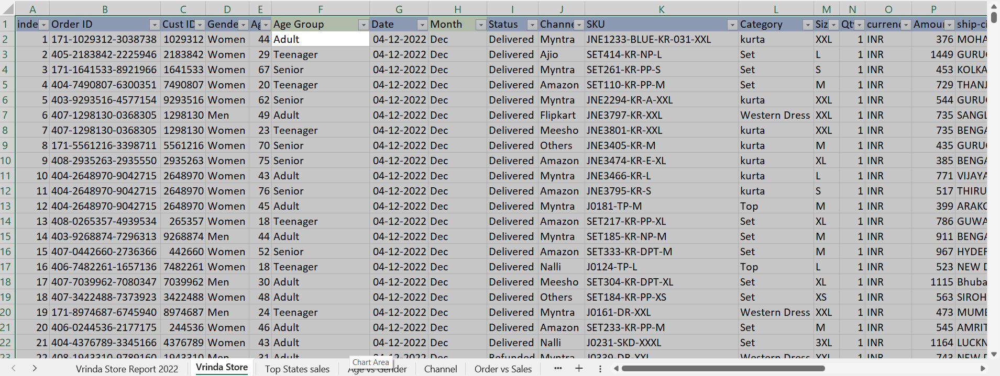

#  Vrinda Store Annual Sales Dashboard (2022)

## Project Overview
This project presents an **interactive Excel dashboard** analyzing Vrinda Store’s 2022 sales data to uncover customer behavior, sales trends, and channel performance.  
The insights help support **data-driven decisions to improve sales in 2023**.

---

## Business Objective
- Understand customer demographics and purchasing behavior  
- Identify top-performing months, states, categories, and sales channels  
- Provide actionable recommendations to increase revenue  

---

## Dashboard Preview
###  Overall Sales Dashboard

---

## Analysis Performed
- Monthly **Sales vs Orders** trend analysis  
- Gender-wise sales contribution  
- Order status distribution  
- Top contributing states by sales  
- Age group vs gender purchasing behavior  
- Channel-wise sales contribution  
- Highest selling product categories  

---

## Key Insights
- Women customers contribute around **65% of total sales**
- **Maharashtra, Karnataka, and Uttar Pradesh** are the top 3 states (~35% contribution)
- **Adult age group (30–49 years)** contributes nearly **50% of total orders**
- **Amazon, Flipkart, and Myntra** contribute about **80% of total sales**

---

## Business Recommendations
- Target **women customers aged 30–49 years**
- Focus marketing campaigns in **Maharashtra, Karnataka, and Uttar Pradesh**
- Run ads, offers, and coupons on **Amazon, Flipkart, and Myntra**
- Align inventory with high-selling categories and regions

---

## Tools & Techniques
- **Microsoft Excel**
  - Data Cleaning & Processing  
  - Pivot Tables & Pivot Charts  
  - Interactive Slicers (Month, Channel, Category)  
  - Dashboard Design & Report Visualization  

---

## Key Skills Demonstrated
- Data Cleaning & Preparation  
- Exploratory Data Analysis (EDA)  
- Pivot Tables & Pivot Charts  
- Slicers & Interactive Dashboards  
- Data Visualization & Reporting  
- Business Insight Generation  

---

## Final Deliverable
An **interactive Excel dashboard** that enables stakeholders to filter data dynamically and quickly identify sales trends and growth opportunities.
